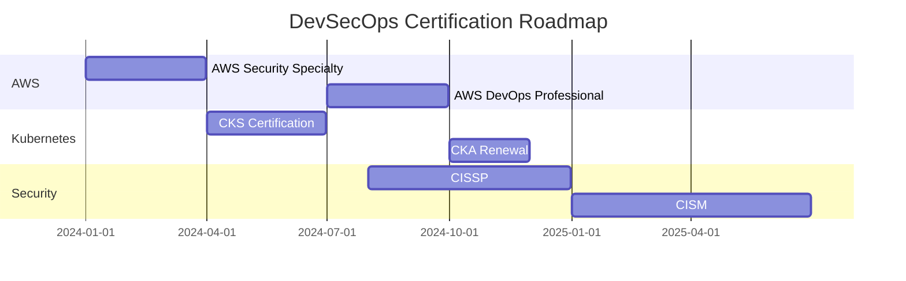

# 💼 Module 7: Career Advancement Guide for Thai Market

## 📋 ภาพรวม Career Guide

Module สุดท้ายนี้เป็นคู่มือการพัฒนาอาชีพสำหรับตลาด DevSecOps ในประเทศไทย ครอบคลุมตั้งแต่การเตรียมตัวสัมภาษณ์ การสร้าง Portfolio จนถึงกลยุทธ์การเจรจาเงินเดือน

### 🎯 Learning Objectives

เมื่อจบ Module นี้ คุณจะสามารถ:

1. **💼 Job Market Analysis**
   - เข้าใจภาพรวมตลาดงาน DevSecOps ในไทย
   - รู้จักบริษัทเป้าหมายและตำแหน่งงาน
   - ติดตามความเคลื่อนไหวของตลาด

2. **📝 Portfolio Development**
   - สร้าง GitHub Portfolio ที่น่าประทับใจ
   - เขียน Technical Documentation ที่มีคุณภาพ
   - สร้าง Demo และ Presentation Materials

3. **🎤 Interview Preparation**
   - เตรียมตัวสำหรับคำถามทางเทคนิค
   - ฝึกฝนการนำเสนอ Project
   - เข้าใจ Behavioral Questions

4. **💰 Salary Negotiation**
   - รู้อัตราเงินเดือนในตลาด
   - เทคนิคการเจรจาเงินเดือน
   - Package และ Benefits ที่ควรพิจารณา

5. **🚀 Continuous Learning**
   - วางแผนการเรียนรู้ต่อเนื่อง
   - ติดตาม Technology Trends
   - สร้าง Professional Network

## 📊 Thai DevSecOps Job Market Analysis

### 🏢 Target Companies & Salary Ranges

| Company Category | Companies | Entry Level | Mid Level | Senior Level | Lead/Architect |
|-----------------|-----------|-------------|-----------|--------------|----------------|
| **Traditional Banks** | SCB, BBL, KBANK, KTB | ฿60k-80k | ฿90k-130k | ฿150k-220k | ฿250k-350k |
| **Digital Banks** | SCB X, Krungthai NEXT | ฿70k-90k | ฿100k-140k | ฿160k-240k | ฿280k-400k |
| **E-commerce** | Lazada, Shopee, JD Central | ฿65k-85k | ฿95k-135k | ฿145k-210k | ฿240k-320k |
| **Tech Giants** | LINE, Agoda, Grab | ฿80k-120k | ฿130k-180k | ฿200k-300k | ฿350k-500k |
| **Fintech** | Bitkub, Omise, 2C2P | ฿75k-95k | ฿110k-150k | ฿170k-250k | ฿280k-380k |
| **Consulting** | Accenture, Deloitte, PwC | ฿60k-75k | ฿85k-120k | ฿140k-200k | ฿220k-300k |
| **Startups** | FlowAccount, Fillgoods | ฿55k-70k | ฿80k-110k | ฿120k-180k | ฿200k-280k |

### 📈 Market Trends (2024)

**Growing Demand Areas:**
- 🏦 **Banking Digital Transformation**: +40% job openings
- ☁️ **Cloud Security**: +35% demand
- 🐳 **Container Security**: +30% growth
- 🤖 **Security Automation**: +45% interest
- ⚖️ **Compliance Automation**: +25% (PDPA impact)

**Technology Focus:**
- **AWS Security**: 85% of job postings
- **Kubernetes Security**: 70% requirement
- **Terraform**: 60% of infrastructure roles
- **Python/Go**: 80% programming requirements
- **DevOps Tools**: Jenkins, GitLab, GitHub Actions

### 🎯 Role Progression Path

```
Junior DevSecOps Engineer (1-2 years)
├── Focus: Learning fundamentals, tool implementation
├── Salary: ฿45k-70k
└── Key Skills: Basic security, CI/CD, cloud basics

    ↓

Mid-level DevSecOps Engineer (3-5 years)
├── Focus: Architecture design, team collaboration
├── Salary: ฿80k-130k
└── Key Skills: Security architecture, automation, compliance

    ↓

Senior DevSecOps Engineer (5-8 years)
├── Focus: Leadership, strategy, complex systems
├── Salary: ฿130k-220k
└── Key Skills: Team leadership, business alignment, innovation

    ↓

DevSecOps Lead/Architect (8+ years)
├── Focus: Organization-wide security, strategy
├── Salary: ฿220k-400k
└── Key Skills: Executive communication, business strategy, team building
```

## 🛠️ Portfolio Development Strategy

### 📁 GitHub Portfolio Structure

**Essential Repository Structure:**
```
your-username/
├── devsecops-portfolio/          # Main showcase repository
│   ├── README.md                 # Professional introduction
│   ├── projects/                 # Individual project showcases
│   ├── certifications/           # Certification badges and proof
│   ├── presentations/            # Slide decks and demos
│   └── resources/               # Learning resources and notes
├── infrastructure-as-code/       # Terraform and CloudFormation
├── security-automation/          # Security tools and scripts
├── kubernetes-security/          # K8s security implementations
├── compliance-frameworks/        # PDPA, SOC2 implementations
└── monitoring-solutions/         # Observability stack
```

### 📝 Professional README Template

```markdown
# 🔒 [Your Name] - DevSecOps Engineer

[](your-linkedin)
[](cert-link)
[](cert-link)

## 👨‍💻 About Me

Experienced DevSecOps Engineer specializing in secure cloud infrastructure and 
compliance automation for the Thai market. Passionate about integrating security 
into every aspect of the software development lifecycle.

### 🎯 Expertise
- **Cloud Security**: AWS, Azure, GCP security architecture
- **Container Security**: Kubernetes hardening, policy enforcement
- **Compliance**: PDPA, BOT guidelines, SOC2 implementation
- **Automation**: Security scanning, infrastructure as code
- **Languages**: Thai (Native), English (Professional)

## 🏆 Key Achievements

- 🔒 **Reduced security vulnerabilities by 85%** through automated scanning
- 🚀 **Implemented zero-downtime deployment** for financial services platform
- ⚖️ **Led PDPA compliance project** for major Thai bank
- 📊 **Built security monitoring** serving 10M+ daily users

## 🛠️ Technical Stack

### Cloud Platforms


### Container & Orchestration


### Security Tools


### Infrastructure as Code


## 🚀 Featured Projects

### 1. [Thai E-commerce Security Platform](./projects/ecommerce-security/)
**Problem**: Major e-commerce platform needed PDPA compliance and security hardening
**Solution**: Implemented end-to-end security with automated compliance monitoring
**Impact**: 100% PDPA compliance, 90% reduction in security incidents
**Tech**: AWS, Kubernetes, Terraform, OPA, Prometheus

[View Project](./projects/ecommerce-security/) | [Live Demo](https://demo-link) | [Presentation](./presentations/ecommerce-security.pdf)

### 2. [Banking DevSecOps Pipeline](./projects/banking-pipeline/)
**Problem**: Traditional bank needed secure CI/CD for digital transformation
**Solution**: Built comprehensive security-first DevOps pipeline
**Impact**: 50% faster deployments, zero security vulnerabilities in production
**Tech**: Jenkins, GitLab, Trivy, SonarQube, AWS Security Hub

[View Project](./projects/banking-pipeline/) | [Case Study](./projects/banking-pipeline/case-study.md)

### 3. [Kubernetes Security Framework](./projects/k8s-security/)
**Problem**: Multi-tenant Kubernetes environment needed security standardization
**Solution**: Implemented comprehensive K8s security framework
**Impact**: CIS Kubernetes Benchmark compliance, automated policy enforcement
**Tech**: Kubernetes, Falco, OPA Gatekeeper, Network Policies

[View Project](./projects/k8s-security/) | [Documentation](./projects/k8s-security/README.md)

## 📜 Certifications

- 🏆 **AWS Certified Security - Specialty** (2024)
- 🏆 **Certified Kubernetes Security Specialist (CKS)** (2024)
- 🏆 **AWS Solutions Architect - Professional** (2023)
- 🏆 **Certified Information Systems Security Professional (CISSP)** (2023)

## 📊 GitHub Stats


## 🎤 Speaking & Community

- 🎪 **DevSecOps Thailand Meetup** - "PDPA Compliance Automation" (2024)
- 📺 **AWS User Group Bangkok** - "Container Security Best Practices" (2024)
- ✍️ **Tech Blog** - [Medium Articles](your-medium-link)
- 🎓 **Mentoring** - Thai DevSecOps Study Group

## 📞 Contact

- 📧 Email: your.email@example.com
- 💼 LinkedIn: [your-linkedin-profile](your-linkedin)
- 🐦 Twitter: [@yourusername](your-twitter)
- 📱 Phone: +66-xxx-xxx-xxxx

---

*"Security is not a product, but a process. Let's build secure systems together."*
```

### 🎬 Demo Videos and Presentations

**Essential Demo Content:**

1. **Infrastructure Deployment Demo** (5-10 minutes)
   ```bash
   # Script for demo recording
   
   # 1. Infrastructure Overview
   echo "🏗️ Demonstrating secure infrastructure deployment"
   
   # 2. Show Terraform code
   code infrastructure/terraform/modules/vpc/main.tf
   
   # 3. Deploy with security scanning
   make terraform-plan
   make security-scan
   make terraform-apply
   
   # 4. Verify security controls
   make compliance-check
   
   # 5. Show monitoring dashboard
   make open-monitoring
   ```

2. **Security Incident Response Demo** (3-5 minutes)
   ```bash
   # Simulate security incident
   kubectl create pod malicious-pod --image=attacker:latest
   
   # Show detection in Falco
   kubectl logs -f daemonset/falco -n falco-system
   
   # Show automated response
   kubectl get pod malicious-pod  # Should be terminated
   
   # Show incident in dashboard
   open http://localhost:3000/d/security-incidents
   ```

## 🎤 Interview Preparation

### 📋 Technical Interview Questions & Answers

**1. Infrastructure Security**

```
Q: How would you secure a Kubernetes cluster for a financial services company in Thailand?

A: For a Thai financial services company, I would implement:

1. **Compliance First**: Ensure data residency in ap-southeast-1 region
2. **Network Security**: 
   - Private cluster with authorized networks
   - Network policies for micro-segmentation
   - Calico or Cilium for advanced networking
3. **Pod Security**:
   - Pod Security Standards (restricted profile)
   - OPA Gatekeeper for custom policies
   - No privileged containers
4. **Identity & Access**:
   - RBAC with least privilege principle
   - ServiceAccount token automation disabled
   - Integration with corporate identity provider
5. **Runtime Security**:
   - Falco for runtime threat detection
   - Admission controllers for policy enforcement
   - Regular vulnerability scanning with Trivy
6. **Audit & Compliance**:
   - Comprehensive audit logging
   - PDPA compliance monitoring
   - BOT guideline adherence
7. **Data Protection**:
   - Encryption at rest and in transit
   - Secret management with external systems (Vault/AWS Secrets Manager)
   - Regular secret rotation

Example implementation:
```yaml
apiVersion: v1
kind: Pod
metadata:
  annotations:
    container.apparmor.security.beta.kubernetes.io/app: runtime/default
spec:
  securityContext:
    runAsNonRoot: true
    runAsUser: 10001
    seccompProfile:
      type: RuntimeDefault
  containers:
  - name: app
    securityContext:
      allowPrivilegeEscalation: false
      capabilities:
        drop:
        - ALL
      readOnlyRootFilesystem: true
```
```

**2. CI/CD Security**

```
Q: Design a secure CI/CD pipeline for a Thai e-commerce platform.

A: I would design a multi-stage security-integrated pipeline:

**Pipeline Stages:**
1. **Source Security**:
   - Git pre-commit hooks for secret scanning
   - Branch protection rules
   - Signed commits verification

2. **Build Security**:
   - Multi-stage Dockerfiles with distroless base images
   - Dependency vulnerability scanning (Snyk)
   - SAST scanning (SonarQube/CodeQL)
   - License compliance checking

3. **Container Security**:
   - Container image scanning (Trivy)
   - Dockerfile best practices (Hadolint)
   - Image signing with cosign
   - Admission controller verification

4. **Infrastructure Security**:
   - Terraform security scanning (tfsec/Checkov)
   - Infrastructure drift detection
   - Compliance validation (PDPA/BOT)

5. **Deployment Security**:
   - Kubernetes security policies validation
   - Zero-downtime deployment with automated rollback
   - Production approval gates

6. **Runtime Security**:
   - DAST scanning (OWASP ZAP)
   - Performance and security monitoring
   - Incident response automation

**GitHub Actions Example:**
```yaml
name: Secure CI/CD Pipeline

on:
  push:
    branches: [main, develop]
  pull_request:
    branches: [main]

jobs:
  security-scan:
    runs-on: ubuntu-latest
    steps:
    - uses: actions/checkout@v3
    
    - name: Secret Scan
      uses: trufflesecurity/trufflehog@main
      with:
        path: ./
        
    - name: SAST Scan
      uses: github/codeql-action/analyze@v2
      with:
        languages: javascript, python
        
    - name: Dependency Scan
      uses: snyk/actions/node@master
      env:
        SNYK_TOKEN: ${{ secrets.SNYK_TOKEN }}
```
```

**3. Thai Compliance**

```
Q: How would you implement PDPA compliance in a microservices architecture?

A: PDPA compliance in microservices requires multiple layers:

**1. Data Classification & Discovery**:
```python
class PDPADataClassifier:
    def classify_data(self, data_field, content):
        if self.is_personal_data(data_field, content):
            return {
                'classification': 'personal_data',
                'retention_period': 2555,  # 7 years
                'encryption_required': True,
                'consent_required': True,
                'audit_logging': True
            }
```

**2. Consent Management**:
- Distributed consent service
- Event-driven consent updates
- Consent state synchronization across services

**3. Data Processing Controls**:
```yaml
apiVersion: argoproj.io/v1alpha1
kind: Workflow
metadata:
  name: pdpa-data-processing
spec:
  entrypoint: process-personal-data
  templates:
  - name: process-personal-data
    steps:
    - - name: validate-consent
        template: consent-check
    - - name: process-data
        template: data-processing
        when: "{{steps.validate-consent.outputs.result}} == 'valid'"
    - - name: audit-log
        template: audit-logging
```

**4. Rights Management**:
- Right to access: Data export APIs
- Right to rectification: Data update workflows
- Right to erasure: Automated data deletion
- Right to portability: Standardized data formats

**5. Technical Implementation**:
- Service mesh for data flow monitoring
- API gateway for consent verification
- Event streaming for audit trails
- Kubernetes policies for data protection
```

### 🎯 Behavioral Interview Questions

**1. Leadership & Teamwork**

```
Q: Tell me about a time when you had to convince a development team to adopt security practices.

A: "At my previous company, the development team was resistant to implementing 
security scanning in the CI/CD pipeline because it was slowing down deployments.

**Situation**: 2-hour security scans were blocking daily releases
**Task**: Implement security without impacting velocity
**Action**: 
- Analyzed scan bottlenecks and optimized to 15 minutes
- Implemented parallel scanning and fail-fast mechanisms
- Created security champions program with developers
- Showed cost of security incidents vs. scan time

**Result**: 
- Reduced scan time by 87% (2 hours → 15 minutes)
- 100% team adoption within 2 months
- Zero security vulnerabilities in production for 6 months
- Team became advocates for security practices"
```

**2. Problem Solving**

```
Q: Describe a complex security incident you handled.

A: "We had a critical security incident where personal data was potentially exposed 
due to a misconfigured S3 bucket.

**Situation**: Customer data bucket accidentally made public
**Impact**: 50,000 customer records potentially exposed, PDPA violation risk
**Response**:
1. **Immediate (0-1 hour)**:
   - Secured the bucket and revoked public access
   - Initiated incident response team
   - Preserved logs for forensic analysis

2. **Short-term (1-24 hours)**:
   - Analyzed access logs to determine actual exposure
   - Notified DPO and legal team for PDPA compliance
   - Prepared customer communication

3. **Medium-term (1-7 days)**:
   - Implemented bucket policies to prevent recurrence
   - Enhanced monitoring and alerting
   - Conducted team training on S3 security

4. **Long-term (1+ weeks)**:
   - Automated infrastructure scanning
   - Updated incident response procedures
   - Quarterly security reviews

**Outcome**: No actual data access occurred, strengthened security posture, 
improved team capabilities"
```

### 💰 Salary Negotiation Strategy

### 📊 Market Research Template

```python
# Salary Research Framework
class SalaryResearch:
    def __init__(self):
        self.market_data = {
            'position': 'Senior DevSecOps Engineer',
            'experience': '5 years',
            'location': 'Bangkok',
            'company_size': 'Large Enterprise'
        }
    
    def calculate_market_rate(self):
        base_ranges = {
            'junior': (60000, 80000),
            'mid': (90000, 130000),
            'senior': (150000, 220000),
            'lead': (250000, 350000)
        }
        
        adjustments = {
            'aws_certified': 1.15,      # +15%
            'cks_certified': 1.20,      # +20%
            'financial_sector': 1.25,   # +25%
            'english_fluency': 1.10,    # +10%
            'management_exp': 1.15      # +15%
        }
        
        return self.apply_adjustments(base_ranges['senior'], adjustments)

# Example output:
# Base: ฿150,000-220,000
# With certifications and experience: ฿225,000-330,000
```

### 🎯 Negotiation Framework

**1. Preparation Phase**
```
Research Components:
✅ Industry salary benchmarks
✅ Company financial performance
✅ Your unique value proposition
✅ Alternative opportunities (BATNA)
✅ Total compensation package

Value Proposition Template:
"Based on my experience implementing PDPA compliance solutions that saved
[Company X] ฿2M in potential fines, and reducing security incidents by 85%,
I believe my contribution warrants a salary in the range of ฿X-Y, which
aligns with market rates for senior DevSecOps professionals with my
certifications and track record."
```

**2. Negotiation Components**

| Component | Negotiation Strategy | Thai Market Notes |
|-----------|---------------------|-------------------|
| **Base Salary** | Research + 10-20% premium | Most flexible component |
| **Bonus** | Performance-based, 1-3 months | Common in financial sector |
| **Stock Options** | Startup equity, vesting schedule | Less common in traditional companies |
| **Benefits** | Health insurance, life insurance | Standard in Thailand |
| **Learning Budget** | ฿50,000-100,000/year | Growing trend |
| **Remote Work** | Hybrid arrangements | Post-COVID flexibility |
| **Visa Sponsorship** | For foreign candidates | Significant value-add |

**3. Negotiation Script Examples**

```
Opening Position:
"Thank you for the offer. I'm excited about the opportunity to contribute to 
[Company]'s security transformation. Based on my research and the value I can 
bring, particularly in PDPA compliance and cloud security, I was hoping we 
could discuss the compensation package."

Justification:
"In my previous role, I led the implementation of a security framework that:
- Achieved 100% PDPA compliance, avoiding potential ฿5M in fines
- Reduced security incidents by 85%, saving approximately ฿2M annually
- Automated 70% of security processes, improving team efficiency by 40%

Given these results and my AWS Security Specialty and CKS certifications, 
I believe a salary of ฿X would be more aligned with the market and the 
value I can deliver."

Flexibility:
"I'm open to discussing the overall package. If the base salary has constraints,
perhaps we could explore additional benefits like a learning budget, flexible
working arrangements, or performance bonuses."
```

## 🚀 Continuous Learning & Development

### 📚 Learning Roadmap 2024-2025

**Quarter 1: Foundation Strengthening**
- Complete AWS Security Specialty certification
- Deep dive into Kubernetes security (CKS preparation)
- PDPA compliance implementation project

**Quarter 2: Advanced Skills**
- Container security specialization (Trivy, Falco)
- Policy as Code mastery (OPA, Rego)
- Advanced Terraform patterns

**Quarter 3: Leadership Development**
- Security architecture design patterns
- Team leadership and communication skills
- Business alignment and ROI measurement

**Quarter 4: Innovation & Trends**
- Zero-trust security implementation
- AI/ML security applications
- Emerging threat landscape

### 🎓 Certification Timeline



### 🌐 Community Engagement

**Thai Tech Communities:**
- **DevSecOps Thailand** - Facebook Group (5,000+ members)
- **AWS User Group Bangkok** - Monthly meetups
- **Kubernetes Thailand** - K8s community
- **Thai Cybersecurity Community** - Security professionals

**Global Communities:**
- **DevSecOps Community** - International best practices
- **CNCF Slack** - Cloud native security discussions
- **Reddit r/devops** - Industry discussions

**Contributing Strategy:**
1. **Blog Writing** - Share Thai-specific implementations
2. **Open Source** - Contribute to security tools
3. **Speaking** - Present at local meetups
4. **Mentoring** - Guide junior professionals

### 📊 Progress Tracking

**Monthly Goals Template:**
```yaml
month: "January 2024"
goals:
  technical:
    - Complete AWS Security Specialty exam
    - Implement PDPA compliance demo
    - Contribute to 2 open source projects
  
  career:
    - Network with 5 new industry contacts
    - Write 2 technical blog posts
    - Update LinkedIn profile and portfolio
  
  learning:
    - Read 2 security books
    - Complete 1 online course
    - Attend 1 tech meetup

metrics:
  certifications: 1
  github_contributions: 20
  blog_posts: 2
  networking_events: 1
```

## 🎯 Action Plan

### 📋 30-60-90 Day Plan

**First 30 Days: Foundation**
- ✅ Complete DevSecOps Workshop
- ✅ Set up professional GitHub portfolio
- ✅ Update LinkedIn with new skills
- ✅ Apply AWS Security Specialty
- ✅ Join 3 Thai tech communities

**Next 30 Days: Building**
- 🎯 Complete portfolio projects
- 🎯 Start AWS Security Specialty preparation
- 🎯 Write first technical blog post
- 🎯 Network with industry professionals
- 🎯 Practice interview questions

**Final 30 Days: Launching**
- 🚀 Apply to target companies
- 🚀 Schedule informational interviews
- 🚀 Complete certification exam
- 🚀 Present at local meetup
- 🚀 Launch job search campaign

### 📞 Immediate Next Steps

**Today:**
1. Star this repository and fork for customization
2. Create/update LinkedIn profile
3. Start AWS account and begin hands-on practice

**This Week:**
1. Complete Module 1-3 of workshop
2. Set up development environment
3. Join DevSecOps Thailand Facebook group

**This Month:**
1. Deploy complete workshop infrastructure
2. Create first portfolio project
3. Schedule AWS Security Specialty exam

## 🎉 Conclusion

**Congratulations! 🎉**

You've completed the comprehensive DevSecOps Workshop for the Thai market. You now have:

✅ **Technical Expertise**: Infrastructure security, container security, CI/CD automation, monitoring
✅ **Compliance Knowledge**: PDPA and BOT compliance implementation
✅ **Portfolio Projects**: Real-world demonstrations of your capabilities
✅ **Market Intelligence**: Understanding of Thai tech landscape and opportunities
✅ **Career Strategy**: Roadmap for advancement to senior roles

### 🌟 Your DevSecOps Journey Starts Now

**You're Ready For:**
- 💼 Senior DevSecOps Engineer roles (฿130k-220k)
- 🏗️ Cloud Security Architect positions (฿200k-300k)
- 🚀 Technical leadership opportunities
- 🎯 Top Thai tech companies (Grab, LINE, Agoda, Banking sector)

### 📞 Stay Connected

Join our growing community of Thai DevSecOps professionals:

- 🌐 **GitHub**: [DevSecOps Workshop Community](https://github.com/nanthapat-j/devsecops-workshop)
- 💬 **Discord**: Thai DevSecOps Study Group
- 📱 **LinkedIn**: DevSecOps Thailand Network
- 📧 **Email**: community@devsecops-workshop.com

---

**"The future belongs to those who can secure it. Go build amazing and secure things! 🚀"**

**สำเร็จแล้ว! ขอให้โชคดีในการเดินทางสู่ DevSecOps Expert! 🇹🇭**